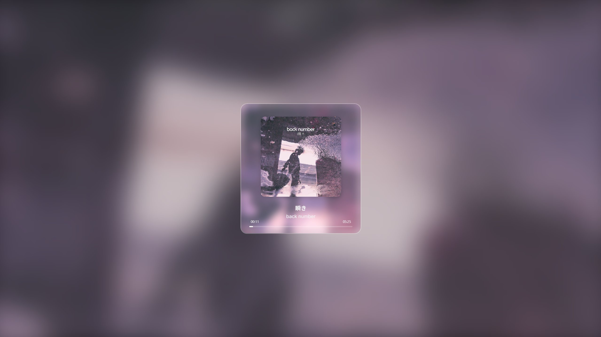

# Immersive Music Player (Rust + Tauri v2 版)

一款跨平台的桌面音乐播放器，采用 **Rust / Tauri v2** 打造后端，前端使用原生 **HTML + CSS + JavaScript**，并配备独特的「Liquid Glass」UI 效果。应用能自动提取音频元数据与封面、实时转码为浏览器友好的立体声 WAV，并在界面中呈现动态模糊与色彩自适应。

 <!-- 如有截图请替换 -->

---

## 功能特性

- **液态玻璃界面**：基于 SVG `feTurbulence` & `feDisplacementMap` 的玻璃畸变背景，封面即时投射。
- **本地文件播放**：通过系统文件选择框加载本地音频/视频文件，无需拖拽或额外服务器。
- **FFmpeg 实时转码**：借助 `ffmpeg-sidecar` 自动下载平台对应的 FFmpeg，可将任意常见封装解码并转码为双声道 WAV。
- **Base64 直传**：音频文件在 Rust 端转码后以 Base64 形式发送至前端，避免本地文件协议的安全限制。
- **沉浸式歌词模式**：按下 `L` 键可开启/关闭与歌曲同步的逐句歌词界面。
- **歌词翻译切换**：当歌词文件包含翻译时，按下 `T` 键可在原文和译文间切换。
- **键盘快捷键**：
  - `Space` 播放 / 暂停
  - `R` 重新播放
  - `F` 窗口全屏开 / 关
  - `V` 极简模式开 / 关
  - `L` 歌词模式开 / 关
  - `T` 歌词翻译开 / 关
- **自适应文字与进度条颜色**：根据封面平均色与亮度，自动选择白色 / 深灰或同色深一阶配色，始终保持可读性。

---

## 技术栈

| 层级 | 技术 |
|------|---------------------------------------------------------------|
| 后端 | Rust · Tauri v2 · ffmpeg-sidecar · tempfile |
| 前端 | HTML5 · CSS3 · Vanilla JS |
| 音频 | FFmpeg（由 ffmpeg-sidecar 自动下载并调用） |

---

## 环境准备

1. **Node.js ≥ 18** （含 npm）
2. **Rust stable** （`rustup` 安装）
3. **Tauri CLI**
   ```bash
   npm install -g @tauri-apps/cli
   # 或 cargo install tauri-cli
   ```
> FFmpeg 会在首次运行时由 `ffmpeg-sidecar` 自动下载，无需手动安装。

---

## 本地运行（开发模式）

```bash
# 克隆仓库
git clone https://github.com/chyinan/Liquid-Glass-Music-Player-APP.git
cd Liquid-Glass-Music-Player-APP

# 安装前端依赖
npm install

# 启动开发模式（前端 + Rust 后端热重载）
npm run tauri dev
```
启动后会自动打开应用窗口，选择音频文件即可播放。

---

## 构建发行版

```bash
# 可选：清理旧构建
cd src-tauri && cargo clean && cd ..

# 生成安装包 / 可执行文件（根据当前操作系统）
npm run tauri build
```
打包产物位于 `src-tauri/target/release/bundle/*` 目录下。

---

## 目录结构

```
Immersive Music Player/
├─ src/            # 前端源码
│  ├─ main.js
│  └─ style.css
├─ src-tauri/      # Rust 后端 + Tauri 配置
│  ├─ src/
│  │  └─ lib.rs    # 主要业务逻辑
│  ├─ tauri.conf.json
│  └─ icons/       # 应用图标（自动生成）
├─ package.json
└─ README.md       # 当前文件
```

---


## 许可证

MIT License © 2025 CHYINAN