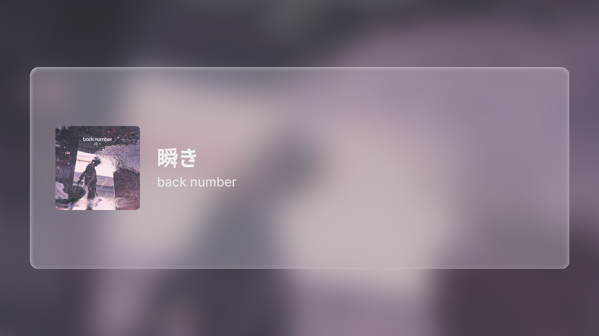
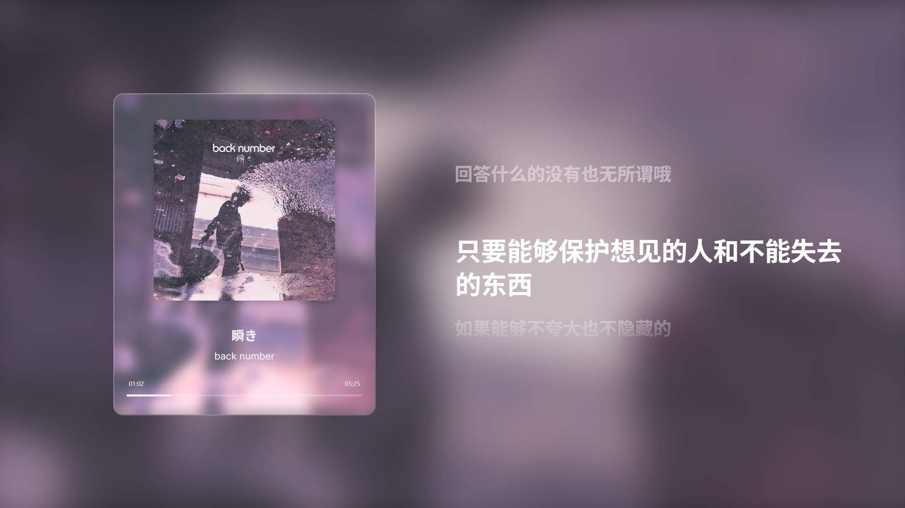
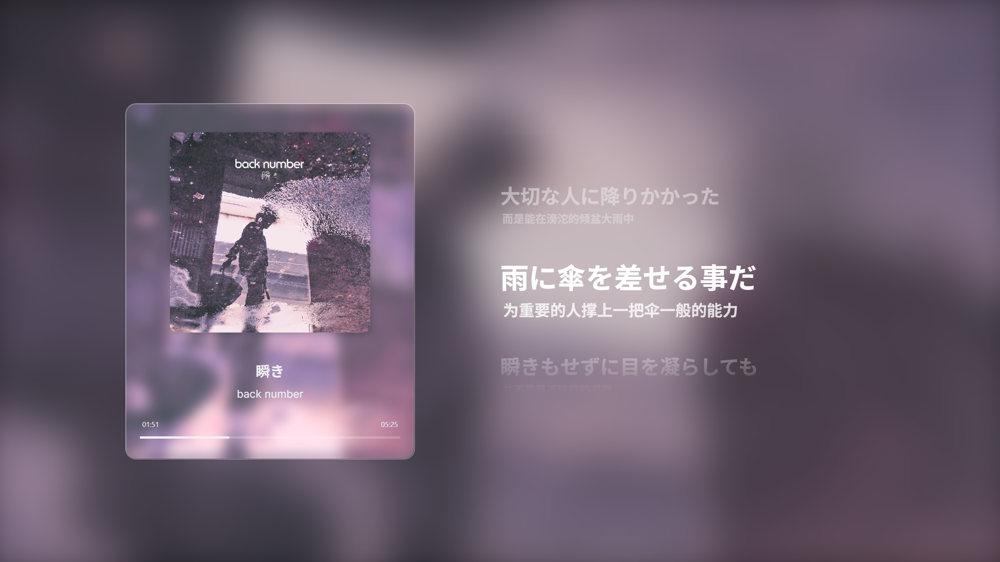
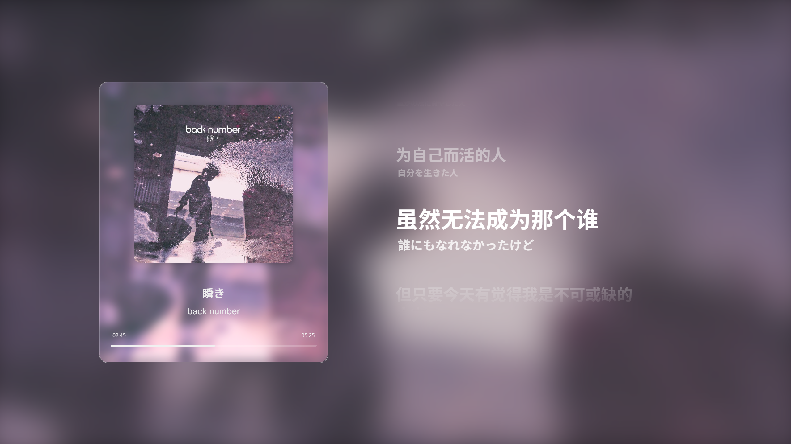
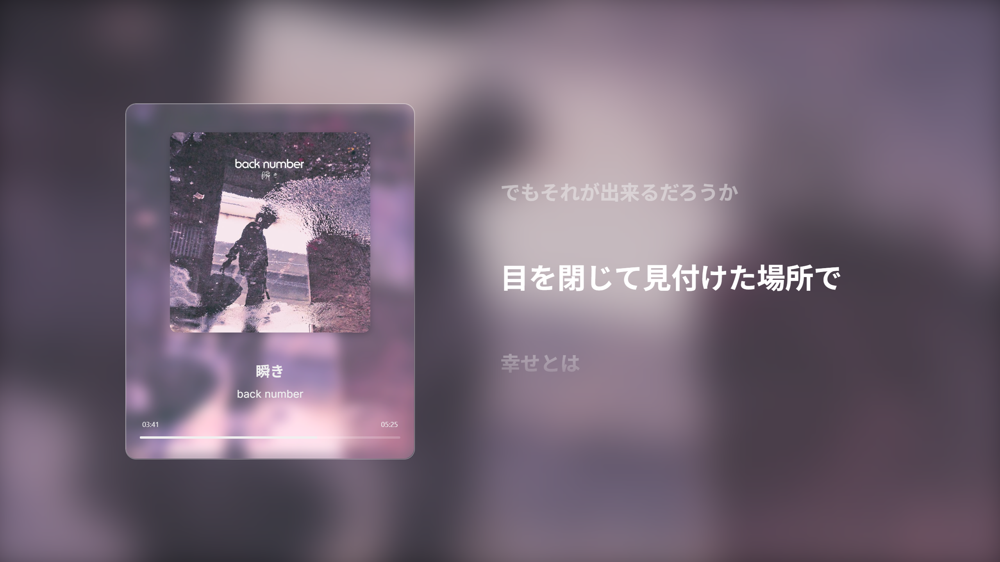

# Immersive Music Player
<p align="center">
  
</p>

一款跨平台的桌面音乐播放器，采用 **Rust / Tauri v2** 打造后端，前端使用原生 **HTML + CSS + JavaScript**，并配备精致的UI界面。应用能自动提取音频元数据与封面、实时转码为浏览器友好的立体声 WAV，并在界面中呈现动态模糊与色彩自适应。

### 界面预览

| 普通模式 | 极简模式 |
|:---:|:---:|
|  |  |
| **纯译文模式** | **双语（上原下译）** |
|  |  |
| **双语（上译下原）** | **纯原文模式** |
|  |  |

---

## 功能特性

- **液态玻璃界面**：基于`backdrop-filter`的精致玻璃拟态效果，配合流动的封面背景，在极简模式下提供顶级的视觉享受。
- **本地文件播放**：通过系统文件选择框或拖拽加载本地音频文件。
- **FFmpeg 实时转码**：借助 `ffmpeg-sidecar` 自动下载平台对应的 FFmpeg，可将任意常见封装解码并转码为双声道 WAV。
- **临时文件缓存**：转码后的 WAV 保存在系统临时目录，缓存文件自动删除，通过 Tauri 的 asset 协议流式播放，降低内存占用同时保持拖动流畅。
- **智能歌词系统**：
  - **智能识别**：自动检测歌曲是否内嵌翻译，若无翻译，则仅在“开启（仅原文）”和“关闭”之间切换。
  - **动态滚动效果**：当前播放的歌词行会高亮并平滑滚动至视觉中心，前后文则以淡出和缩放效果呈现，营造出沉浸式的卡拉OK体验。
- **自定义歌词字体及显示效果**：自动扫描并分类系统安装的字体，允许用户为中文、日文、英文歌词分别指定不同的显示字体和效果。
- **自适应文字与进度条颜色**：根据封面平均色与亮度，自动选择白色 / 深灰或同色深一阶配色，始终保持可读性。
- **键盘快捷键**：
  - `Space` 播放 / 暂停
  - `R` 重新播放
  - `F` 窗口全屏开 / 关
  - `V` 极简模式开 / 关
  - `L` 循环切换歌词显示模式

---

## 技术栈

| 层级 | 技术 |
|------|---------------------------------------------------------------|
| 后端 | Rust · Tauri v2 · ffmpeg-sidecar · tempfile |
| 前端 | HTML5 · CSS3 · Vanilla JS |
| 音频 | FFmpeg（由 ffmpeg-sidecar 自动下载并调用） |

---

## 环境准备

1. **Node.js ≥ 18** （含 npm）
2. **Rust stable** （`rustup` 安装）
3. **Tauri CLI**
   ```bash
   npm install -g @tauri-apps/cli
   # 或 cargo install tauri-cli
   ```
> FFmpeg 会在首次运行时由 `ffmpeg-sidecar` 自动下载，无需手动安装。

---

## 本地运行（开发模式）

```bash
# 克隆仓库
git clone https://github.com/chyinan/Liquid-Glass-Music-Player-APP.git
cd Liquid-Glass-Music-Player-APP

# 安装前端依赖
npm install

# 启动开发模式（前端 + Rust 后端热重载）
npm run tauri dev
```
启动后会自动打开应用窗口，选择音频文件即可播放。

---

## 构建发行版

```bash
# 可选：清理旧构建
cd src-tauri && cargo clean && cd ..

# 生成安装包 / 可执行文件（根据当前操作系统）
npm run tauri build
```
打包产物位于 `src-tauri/target/release/bundle/*` 目录下。

---

## 目录结构

```
Immersive Music Player/
├─ src/            # 前端源码
│  ├─ main.js
│  └─ style.css
├─ src-tauri/      # Rust 后端 + Tauri 配置
│  ├─ src/
│  │  └─ lib.rs    # 主要业务逻辑
│  ├─ tauri.conf.json
│  └─ icons/       # 应用图标（自动生成）
├─ package.json
└─ README.md       # 当前文件
```

---


## 许可证

MIT License © 2025 chyinan